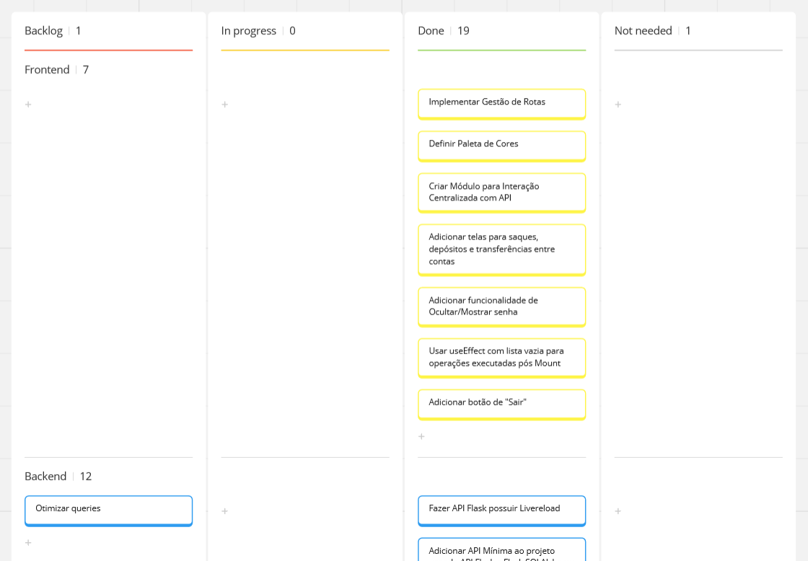
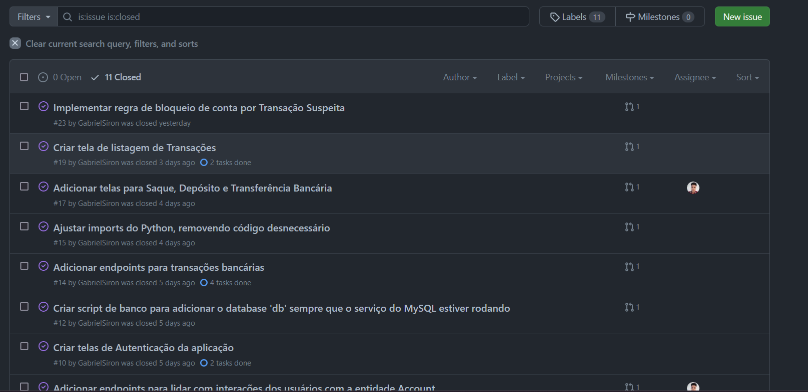

# bloxs-challenge

Olá! Esse é o resultado do meu processo seletivo para entrar na Bloxs.

O sistema desenvolvido aqui tem o intuito de simular um site para um banco, realizando operações comuns
dentro desse contexto, como depósito, saques e listagens de transferências.

## Como Rodar

A aplicação está completamente dockerizada. Portanto, uma vez que o repositório esteja na sua máquina (e que você possua o docker-compose instalado), rode os seguintes comandos:

```
$ docker network create backend
$ docker volume create db-volume
$ docker-compose build
$ docker-compose up
```

 Uma vez no ar, acesse o link `http://localhost:3000` para acessar a aplicação.

## Como Usar

Desenvolvi um seed para a aplicação que alimenta o banco de dados com dois usuários:

- Gabriel Siron:
  - email: gabriel@bloxs.com.br
  - senha: password
  - tipo de conta: Gold (Limite diário de 500 reais)
  - cpf: 999.999.999-99 

- Lucas Ayres:
  - email: lucas@bloxs.com.br
  - senha: password
  - tipo de conta: Diamond (Limite diário de 1500 reais)
  - cpf: 888.888.888-88

Ambas as contas iniciam com um montante de R$10.000,00.

Os tipos de transações possíveis são:
- Saque
- Depósito
- Transferência (Pix)

O Pix exige que se use o cpf de outro usuário como chave (assim como funciona na vida real). Saque e Depósito só dependem do valor sacado/depositado.

Existe uma modalidade de bloqueio automático. Para testar essa feature, tente realizar uma transação com 70% do limite diário. 

Exemplo: limite diário de R$500,00, o valor da transação deve ser de, pelo menos, R$350,01.

Alterar o limite diário de transação não é possível diretamente. Contudo, é possível acessar o serviço do Banco de Dados e setar manualmente o relacionamento para o outro tipo de conta (Ou, ainda mais simples, testar o segundo usuário criado, que tem limite de R$1.500,00).


## Detalhes

Por conta da implementação interna da imagem usada para rodar o MySQL, o terminal fica um pouco bagunçado na primeira execução. Mas todos os serviços estão configurados para executar novamente em caso de falha, então, em algum momento, o MySQL fica disponível de novo e a API consegue conectar nele. Mas isso só ocorre na primeira execução. Uma vez que o serviço esteja devidamente configurado, isso não ocorrerá mais.

Nenhum endpoint precisa do account_id porque essa informação é retirada do token de autenticação

## Collection | Insomnia

Para testar corretamente os endpoints, o primeiro ato deve ser o login. Uma vez feito o login, a API retornará um token de autenticação, que deve ser inserido no header de todos os requests dali em diante. A chave do token é "Authorization".

## Processo de Desenvolvimento

Antes de por a mão na massa com código, tirei um momento para efetuar o planejamento do projeto. Lendo o documento do desafio, extraí as demandas e as organizei por área da aplicação.



Usando o Miro, criei cards para organizar o que eu precisava fazer.

E as primeiras demandas foram para a construção do docker-compose da aplicação. Decidi pegar em código apenas quando a parte de infraestrutura do projeto estivesse funcionando (ou, pelo menos, muito bem encaminhada).

Tive que construir um init.sql para criar um banco de dados dentro do MySQL. 

E também gastei um tempo tentando entender porque minha imagem docker para o Next estava com 1.9GB de espaço ocupado. Após algumas pesquisas, implementei otimizações no Dockerfile do serviço e esse número caiu para cerca de 800Mb.

O serviço do Flask não me deu nenhuma dor de cabeça, apenas tive que compartilhar um volume entre ele e o MySQL para que a conexão procedesse. 

Após finalizar a construção do docker-compose, comecei efetivamente a mexer em código, onde eu também tentei estabelecer uma ordem de desenvolvimento coerente e usei as issues para focar o desenvolvimento em microfuncionalidades, ao invés de simplesmente sair escrevendo tudo que eu tinha como ideia.

Mantive outro pedaço de minha organização no GitHub



Implementei o uso do pre-commit associado a biblioteca black para formatação de código python da aplicação.

Utilizar a API FLask realmente simplificou e muito o trabalho de desenvolvimento.

(Não consigo falar de tudo, então estou citando pontos que foram mais relevantes pra mim)

Também acabei por migrar a Query Interface da aplicação. Antes, estava usando algo como `ClassName.query.filter_by(...)` e na documentação do sqlalchemy eles explicam que, internamente, consideram essa forma de consultar dados legada. Sugeriram migrar tudo para algo como `select(Account).filter_by(...)`. Não existiam muitas diferenças de uso no fim das contas. Tive algum trabalho (leve) para migrar o `paginate` e o `func.sum()` para essa estrutura, porque na documentação eles não explicam como. Então, fui testando algumas coisas até encontrar o modo certo.